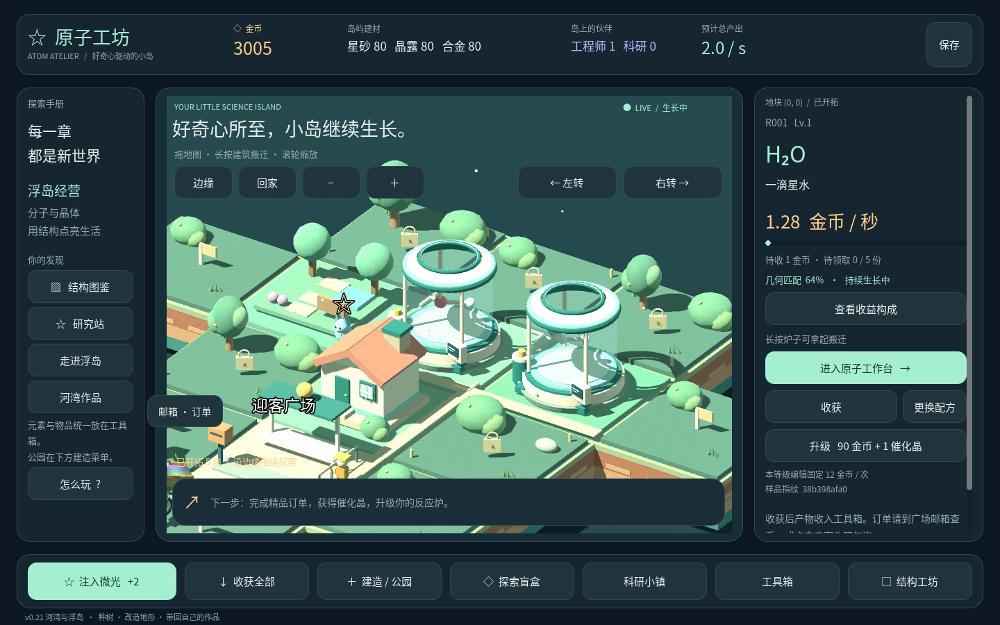
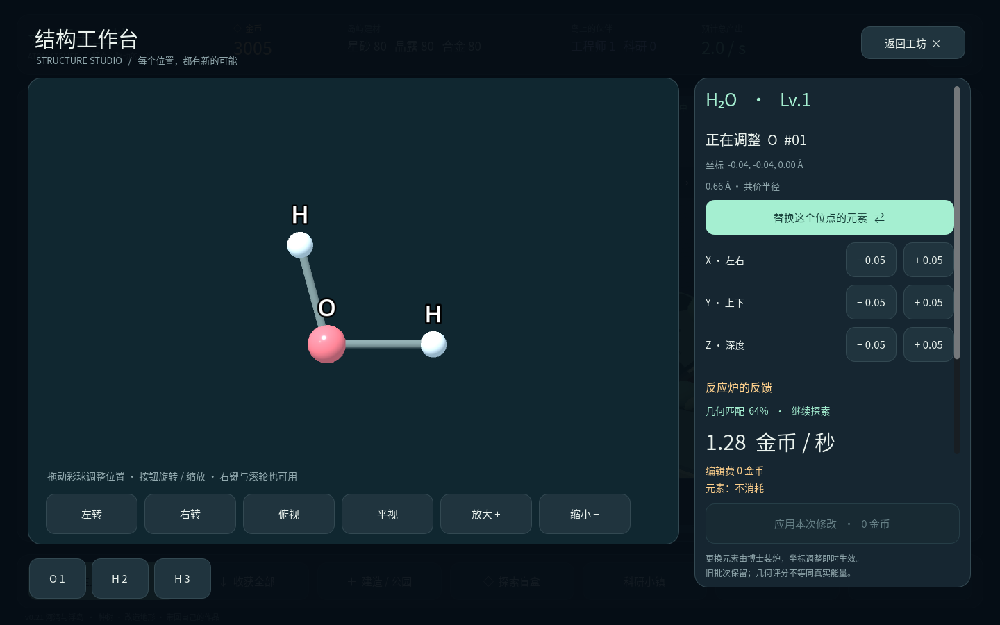
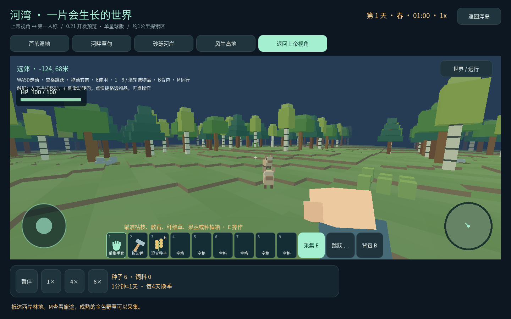
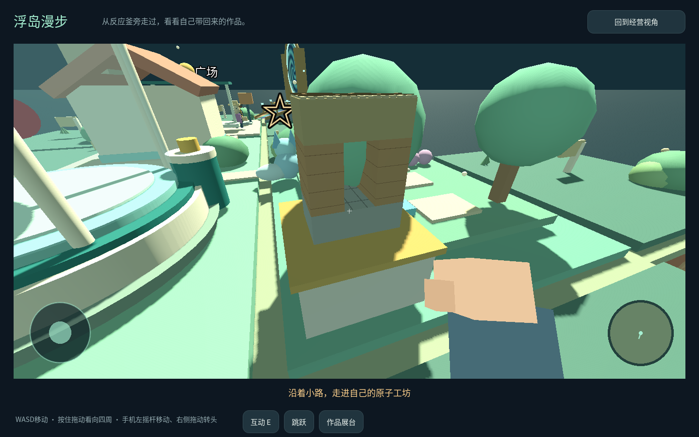
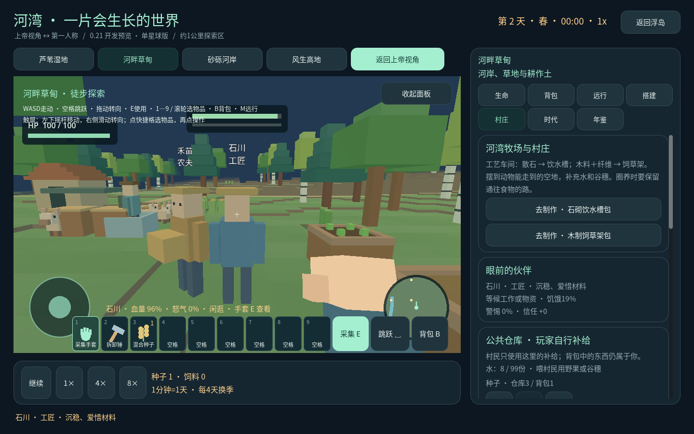
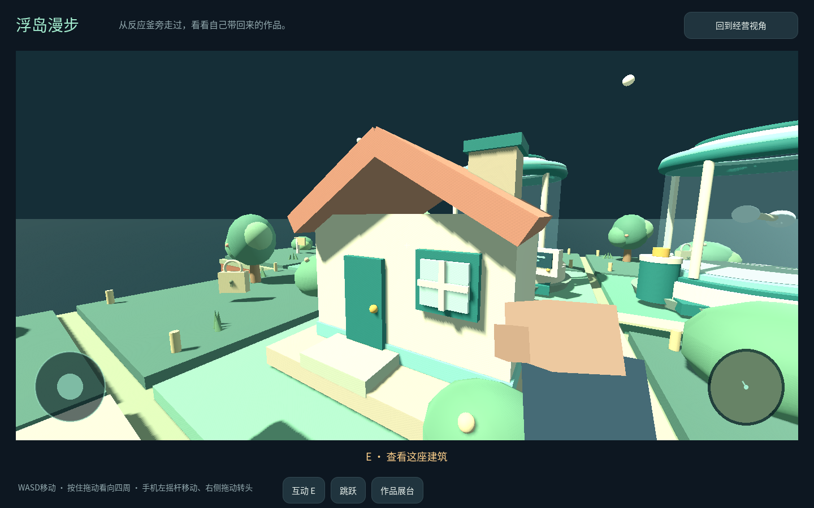

# 原子工坊 · Atom Atelier

**从一颗原子开始，养一座浮岛，再亲手改变一片世界。**

把分子装进透明的反应釜，看它们慢慢生产。用收获的材料扩建工坊、招募伙伴，或走过光桥，去林地里种树、搭屋，再把自己的作品带回家。

**[下载 Android 试玩版](https://github.com/lanchoxie/materials_merging/releases/tag/v0.21.0-organic-15)** · [更新了什么](docs/ORGANIC-15.md) · [反馈问题与想法](https://github.com/lanchoxie/materials_merging/issues)

## 你的第一座原子工坊

点点微光，攒下第一笔金币。放下反应釜，试着挪动其中的原子，观察结构和产率的变化。收获分子与晶体，满足来访收购商的订单，把一小块地慢慢经营成有住宅、道路、公园和科研院所的岛屿。

工程师负责建设，博士参与生产与收集，科研人员帮助你逐步探索更复杂的材料。

## 走过光桥，给材料找一个新用途

浮岛和河湾共用库存。反应釜产出的水样可以浇灌树苗、作物；采到的木料、散石和纤维可以送进工艺车间，加工成真正能放下的墙、屋顶、围栏和种植箱。

河湾有昼夜与季节，也有在附近活动的动物和旅人。你可以切换上帝视角观察，或以第一人称走进树林。

- **砍树与种树**：橡树、白桦、松树外形不同。成熟树木产出木料和树种，种下后慢慢生长，用水样浇灌可以加快进度。
- **挖土与搭建**：用铲子挖低地面，收集土方，再填高别处。用工坊制造的构件搭小屋、围栏与台阶，拆除后材料回到原包。
- **照顾生命**：种植箱可以播种、浇水、收获，草甸小兽可以喂食。攻击会改变生命值与怒气，温顺动物逃开，林地野猪和人类会反击。
- **把作品带回家**：微缩器能把连在一起的小建筑装入背包，带回浮岛摆成展品；收回后也能在河湾展开。

## 给河湾添一点烟火气

用散石做饮水槽，用木料和纤维做饲草架。往里面装水样和谷穗，小鹿会走来喝水、吃东西，累了伏下休息；新发现的林地还能遇见野猪。

邀请居民定居，把种子、饮水和食物放进公共仓库。农夫会搬料、播种、浇水，再把收成带回来；工匠维护磨损的设施。来访的商人带着有限的树种，可以用收获的谷穗交换。装备采集手套，走近伙伴按 E，看看他们正在做什么、记得什么。

## 走进自己的小岛

点击“走进浮岛”，从反应釜、小屋和展台旁走过。走近反应釜可以打开原子工作台，完成编辑后继续从原处漫步；沿着光桥则能前往河湾。第一人称中有手持物品、走动和挥动动画。

## 从反应釜开始做有机物

首个有机物预览从尿素开始：选中自己的反应釜，打开「有机物 · 反应釜合成」，准备元素并等待博士装炉、炉内合成，再收获尿素和水样；工艺车间制造配料罐，河湾里加入样品，等晶粒溶解后分装成有限的溶液，施用到种植箱。温和补肥会加快生长，过量施用会让叶尖受损；旁边的种植箱可以作为对照。每个批次、每瓶溶液和每个地块都有独立账本，未知毒性不会被当成安全或通用伤害。

先看 [反应釜合成路线](docs/ORGANIC-15.md)，再去 [河湾配水与施肥](docs/ORGANIC-14.md)。

## 开始试玩

在 [下载页](https://github.com/lanchoxie/materials_merging/releases/tag/v0.21.0-organic-15) 选择以 `.apk` 结尾的文件，安装后横屏游玩。支持 Android 7.0 及以上的 ARM64 / ARMv7 设备。当前为 **0.21.0-organic-15 开发预览**；Android 真机体验仍待验证。

| 操作 | 电脑 | 手机 |
| --- | --- | --- |
| 移动、看向四周 | WASD；按住鼠标拖动 | 左摇杆；右侧拖动 |
| 跳跃 | 空格 | 跳跃按钮 |
| 使用手中物品 / 查看 | E；拿手套时E查看生物 | 使用 / 查看按钮 |
| 攻击生物 | F；拿手套时也可左键攻击 | 右上角攻击按钮 |
| 背包、切换物品 | B / Tab；1—9 或滚轮 | 背包按钮；快捷栏 |
| 远行 | M | 世界 / 远行 |

放置构件：**B背包 → 构件 → 选物品 → 拿在手上 → 对准地面 → 绿色预览时按E或点放置**。木料和散石先送工艺车间加工；树种、土方可直接使用。详细操作见[攻击与放置指南](docs/INTERACTION-13.2.md)。

建议先试这条小旅程：**收获水样 → 走过光桥 → 砍树收树种 → 在空地种下 → 用水样浇灌**。想盖房子，再把木料送到浮岛的工艺车间加工。

当前探索区直径约1公里。地形支持地表挖填，地下洞穴和房屋室内尚未开放。微缩作品上限为64块、8×8×8格；时代与生态系统会继续扩展。村民目前采用简单的局部绕行，请给仓库与田地留通道。

给关心科学与开发的朋友

结构评分、物性响应与生态时间经过游戏化简化；它们用于帮助理解材料与环境之间的联系。[科学说明](docs/SCIENCE.md) 记录模型依据和边界。[有机物入门](docs/ORGANIC-14.md) 已开放尿素配水、分装与苗圃补肥；饱和溶解度、糖醇工艺和动物毒理仍在[后续计划](docs/ORGANIC-MATERIALS-PLAN.md)中。

源码使用 Godot 4.7.2。用编辑器导入根目录的 `project.godot`，运行主场景即可。数值和配方集中在 `data/`，玩法脚本在 `scripts/`，检查在 `tests/`。开发工具、存档与签名密钥不随源码提供。

Android 包的检查范围、校验值和已知限制见 [验证记录](docs/ANDROID-VALIDATION.md)。Godot 与字体的第三方许可分别位于 `assets/licenses/` 和 `assets/fonts/OFL.txt`。

