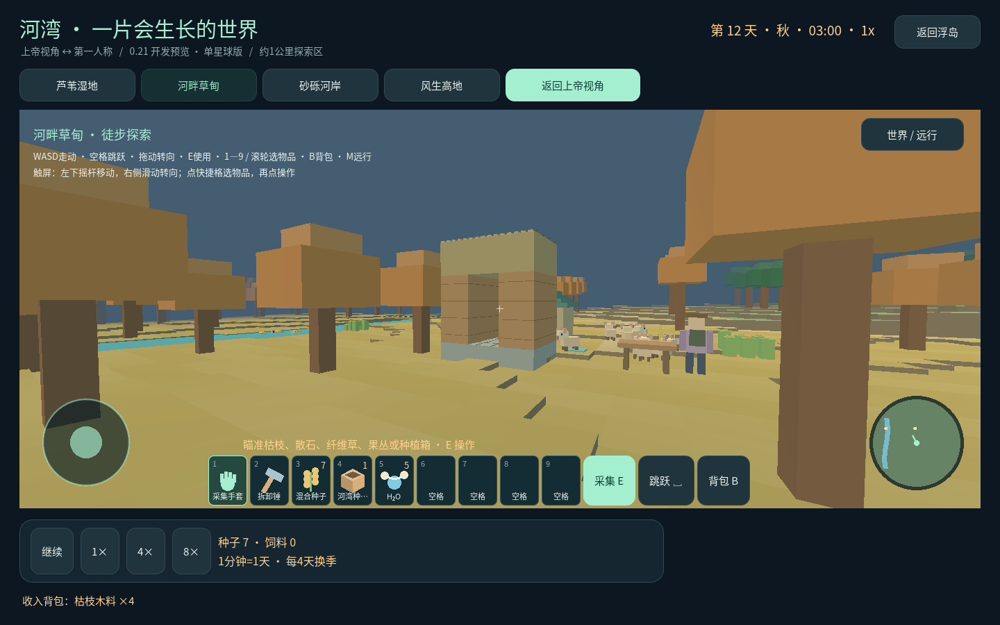
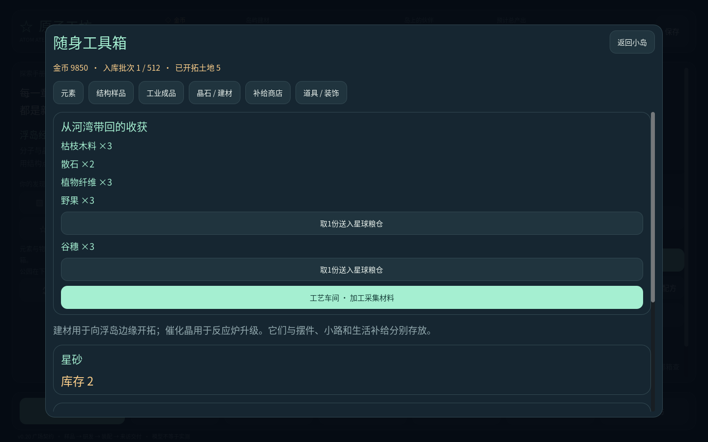

# 原子工坊 · Atom Atelier

从原子与分子出发，经营一座浮岛工坊，再把有限材料带进可以第一人称探索的河湾世界。

一个中文 3D 科学经营与生态沙盒原型，使用 Godot 与程序化模型开发。当前版本为 **0.21.0-homestead-11 开发预览**，玩法仍在迭代。

**[下载 Android APK](https://github.com/lanchoxie/materials_merging/releases/tag/v0.21.0-homestead-11)** · [版本与玩法说明](docs/V0.21-PREVIEW.md) · [验证记录](docs/ANDROID-VALIDATION.md)

## 可以怎么玩

- 在浮岛摆放反应炉、调整原子位置与键，收获结构样品，完成性质订单。
- 招募工程师与科研人员，建设住宅、道路、公园与工艺车间。
- 经广场光桥进入河湾，在第一人称和上帝视角之间切换；走动、跳跃、探索流式地形。
- 从背包与九格快捷栏选择真实库存，采集枯枝、石料和植物原料，送入工艺车间加工构件。
- 搭建小屋与围栏，放置种植箱，播种、用有限水源浇水、等待成熟并收获；用野果喂食。
- 观察昼夜、季节和简化的生态变化，材料供给与环境条件会改变部分结果。

## Android 安装

下载 Release 中的 `AtomAtelier-0.21.0-homestead-11-android.apk`。支持 Android 7.0+、ARM64 / ARMv7、横屏触控，约 69.5 MiB。包名为 `org.atomatelier.demo`，versionCode 为 **23**，使用与之前预览相同的测试签名。

SHA-256：`12697863cc0aa51f49847acbc9cdd48adf584cf9c45c3cac64393bad0bd5771d`。

包内容、签名及从 APK 解包运行的桌面检查已通过，**尚未进行 Android 真机验收**。更换版本前建议保留存档；卸载应用会清除应用私有存档。

## 源码运行

仓库包含源码和资产，不附带 Godot、Android SDK、JDK、导出模板或签名密钥。本次导出使用 Godot **4.7.2**。

用 Godot 导入根目录 `project.godot` 后运行主场景。数值和配方位于 `data/`，玩法模型与界面位于 `scripts/`，回归检查位于 `tests/`，科学边界与设计记录位于 `docs/`。

已有的 Windows 便携脚本依赖本地 `tools/godot/` 等目录。Android 导出请自行配置对应模板、SDK/JDK 与签名；新签名不能覆盖已有测试签名版本。APK 附件不进入源码 Git 历史。

## 当前边界

这是可玩原型，不是完整 Minecraft 或无限宇宙。可搭拆自己的构件，尚不能任意挖掘地形；时代、人类社会、复杂演化和任意新材料的物性预测仍在设计与迭代中。旧的材料试验星球已退役，历史文档保留在归档中。

结构评分、生态阈值、时间尺度和部分物性假设属于教学模型，不应作为真实材料计算或工程设计结果。参考资料与假设边界见 [科学说明](docs/SCIENCE.md)、[科研玩法](docs/SCIENCE-V0.7.md) 与 [河湾预览说明](docs/V0.21-PREVIEW.md)。

Godot 及字体的第三方许可随资产保留于 `assets/licenses/` 与 `assets/fonts/OFL.txt`。
