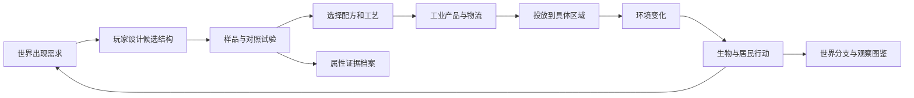

# 原子工坊：材料驱动的多世界沙盒

2026-09-22 更新：旧材料试验星球及时代场景已从运行代码退役；后续时代统一构建在第一人称河湾世界上。浮岛工坊、材料档案与订单独立保留。历史阶段描述不代表继续维护旧系统，见 [退役记录](PLANET-RETIREMENT.md)。

2026-09-22方向更新：按用户批准的上帝视角方案，优先建设连续地形、区域进入、动植物生命与真实背包投放。最新实现和边界见 [0.21河湾预览](V0.21-PREVIEW.md)；下方原跨时代章节保留为既有系统记录，后续以河湾方向优先。

版本：设计里程碑 E1 · 2026-09-19。0.11 已实现水箱与副本；0.12已接通供氧器、有限补给、两个隔离生态舱、迁移/损失/恢复与历史回看，见 [V0.12.md](V0.12.md)。0.12.1已接通铜铝组件对照、有限供料加工、支架约束和设备冷却，见[V0.12.1.md](V0.12.1.md)。0.13已接通三个连通水域、两种古生态灵感起点、有限过滤/收割及营养守恒，见[V0.13.md](V0.13.md)。更多物性产品、完整食物网与时代居民仍待开发。持续开发目标保持进行中；后续QQ交付以较新的DELIVERY-POLICY.md为准。

## 1. 玩家经营一座实验岛，也影响一群会自己生活的世界

玩家在浮岛创造材料、验证用途、组织生产，把成品送入一个具体世界。生物会迁移、繁殖、争夺食物；居民会提出需求、加工物资、修建基础设施，再产生新需求。玩家观察后果，选择下一次干预，留下可回看的世界故事。

核心乐趣是三个问题：**同样的材料，放在哪里？做成什么？会帮助谁，又改变谁的生活？**

不设一个统领万物的“材料战力”或“文明进度”。适合导线的材料未必适合隔热墙；让人类生活更方便的工程，也可能占用动物栖息地。图鉴收集材料、用途和观察到的因果故事，三个目标都可独立推进。

## 2. 先区分物质、物性、产品和服务

|层|例子|玩家能做什么|数据归属|
|---|---|---|---|
|结构样品|自己调整的 H₂O、一个晶胞、新结构|命名、编辑、复制、测试|不可变样品快照|
|材料与状态|液态水、退火铜、活性炭、某种薄膜|比较特定条件下的属性|材料档案与独立证据|
|工艺与成品|水箱、滤芯、导线、封装太阳能组件|选择配方、安排生产、运输|配方版本与产品批次|
|持续服务|供电、供热、供水、通信、计算|接入设施，分配容量，维护|区域网络与消耗账本|
|生态/社会结果|鱼回游、居民搬家、工坊扩建|观察、比较、决定新干预|世界状态与因果事件|

电力不是一种可放进原子背包的分子。发电机提供功率，电池储存能量；水厂处理一定流量，滤芯有寿命。工具箱保留“元素 / 结构样品 / 工业原料 / 成品设备 / 消耗品 / 装饰”，电力和热力显示在线路与设备上。

**计量先统一：**样品用“份”，工业教学原型用明确的“标准包 / 箱 / 件”。不把样品份数冒称摩尔，不把游戏电量点标成 kWh。需要真实物料衡算的配方以后单独启用 kg、mol、kWh，并完整迁移输入、产物、损耗与能量；同一配方不混两套计量。真实物性仍使用 SI 单位，和游戏库存单位分开。

## 3. 材料属性：每一种性质独立有据可查

|属性组|保存的性质与条件|产生的选择|
|---|---|---|
|电与光|电导率、介电性质、带隙、光吸收；温度、相、方向、测试方式|导线 / 绝缘层 / 吸收层；不能由带隙直接得到整块电池效率|
|热|热导率、热容、相变温度；温度范围、材料牌号|散热片 / 保温层 / 蓄热模块；导热快不等于耐热高|
|机械|密度、弹性、强度、韧性、耐磨；加工和测试条件|轻型车辆、桥梁、工具、防护；硬不等于不脆|
|流体与界面|孔隙、渗透、润湿、对指定溶质的吸附容量|过滤、吸附、储液；有孔不等于能去盐|
|化学|溶解、腐蚀、氧化、可燃性、反应兼容性|海边设备寿命、封装、燃料储运；不是一个万能“活性值”|
|能源|低/高位热值分别记录、设备效率、储能循环条件|供热、发电、交通；单位质量和单位体积表现不同|
|生态暴露|物种/群体、介质、剂量、暴露时间、可利用形态|营养、胁迫、迁移、死亡；不用“毒性 80”对所有生命通杀|
|经营|采购成本、工时、供应波动、维修与回收成本|玩家取舍；完全独立于真实物性|

第一批可核对的对照是铜、铝和 304 不锈钢的导热与密度。NIST 在 295 K 的参考表给出铜 400、铝 235、304 不锈钢 15 W/(m·K)，对应密度约 8960、2700、8000 kg/m³。这些是指定来源的参考值，不是所有牌号和工艺的恒定真值。[NIST 参考表](https://www.nist.gov/ncnr/neutron-instruments/sample-environment/sample-mounting/reference-tables)

据此可设计两种不同测试：同尺寸下比较导热，同重量限制下比较构件尺寸。整台散热设备还受几何、接触和空气流动影响，不能把材料热导率直接当总散热效率。

现有游戏只有 12 种元素、14 个结构模板，尚无 Cu、Al、Fe、Si、P。初期这些以**供应商提供的工业参考材料**进入，档案清楚注明来源；后续有结构与半径数据后，再加入玩家原子工作台。不能把购买的铜片记成玩家已发现铜晶体。

### 未知材料仍然值得创造

1. **参考材料：**核对相、状态与条件后，读取对应属性记录。来源值不是本次玩家样品的实测值。
2. **范围内的估计：**按某一材料族、某一属性、固定条件建立模型；先用中间数据检验，再允许区间内插值，保留误差。跨晶相、缺陷机制、渗流阈值时停止套用线性平均。
3. **限定方法计算：**保存输入结构指纹、方法和版本、验证范围、误差。教学弹簧势和一维 DFT 不提供真实宏观物性。
4. **没有适用证据：**属性保留未知。允许外观收藏、展览、探索委托；有已验证属性的部分，可先进入相应用途的小规模测试。

博士完成实验动画并不会凭空获得现实测量结果。每个结果都须落在引用数据、适用模型或明确的游戏假设之一；花钱等待不能把假设升级成“真实实测”。新增实验玩法首先改变证据的组织、比较和适用条件，不编造真值。

自由沙盒可以额外允许玩家设置“假想材料属性”，以体验一种超轻、耐热或高导电材料会造成什么后果。其卡片、世界和结果都标为**假设实验**，不冒充发现了真实材料；假设结果不能进入常规贸易认证。这样既保留任意创造的自由，也不靠伪造物性填数据库。

## 4. 氧气不是全局加成：世界按暴露与需求响应

氧气对不能耐受氧的早期微生物可能造成冲击，这适合做一个早于泥盆纪的厌氧生命序章。泥盆纪已经有需要氧的动物，不能把这个时代设成“加氧就灭绝”。[Smithsonian：早期生命与氧化事件](https://naturalhistory.si.edu/education/teaching-resources/life-science/early-life-earth-animal-origins)

模拟分别保存大气组成/压力、水中溶解氧与局部暴露。H₂O 中化学键合的氧不直接计入溶解 O₂。气罐必须通过设备或明确的释放过程改变某个区域；不能拖一下就均匀改变全星球。生命群体有氧耐受、温度、盐度、食物与栖息地需求；每项响应有自身范围。

首版尚未统一真实质量/体积前，氧状态显示教学指标，不冒称 mg/L。pH 也不能线性平均：未接入酸碱平衡时只显示标明抽象的酸化压力。区域交换先计算后统一提交，耗用不得超过现有库存，避免遍历顺序或事后裁零制造物料。

|玩家行为|先发生什么|后续可见故事|玩家还有什么选择|
|---|---|---|---|
|向厌氧微生物浅池增氧|局部暴露改变，敏感群落受损|菌毯覆盖缩小；耐受群体获得空间|保留隔离避难池；比较停止投放后的恢复|
|给缺氧鱼湾安装供氧设备|传质与耗氧竞争，溶解氧逐步改变|鱼从相邻水域回游；水底群落恢复更慢|持续补给，或追查造成缺氧的污染源|
|持续向水域增加营养物|藻类增长，遮光，死亡有机质积累|分解耗氧，鱼群迁移，固定生物受损|控源、植被缓冲带、收割藻类、局部增氧|
|将高盐水排入淡水池|盐度梯度形成|不耐盐群体退缩，其他群体竞争空间|调整排口、淡化浓水回收、隔离储存|
|提高植被区可燃负荷并出现火源|是否蔓延还取决于含水和氧条件|局部火带、裸地与后续恢复|防火隔离、保水、改变建设布局|
|把未知材料直接丢进海湾|缺乏暴露数据，进入封闭试验流程|试验笼和取样浮标出现|扩大测试、回收、改为封装用途|

营养物引起的缺氧要有延迟链：营养输入 → 藻类增长 → 有机物分解 → 耗氧 → 生物响应。这是可参考的方向；游戏中的阈值、耗时和种群恢复速度需要调参，不能直接当真实古生态预测。[NOAA：营养污染](https://oceanservice.noaa.gov/facts/nutpollution.html)

死亡确实可以发生，也能造成局部灭绝与食物网变化。表现采用活动减少、迁移、空巢、化石/观察记录等方式。测试世界允许回到分支起点；常规世界可救援，但不无条件复活已消失的物种。引入物种需有来源与栖息条件，不能把材料投入自动转换成恐龙。

## 5. 合成表要分“制造设备”和“运行设备”

以下是内容规划；数量、工时和效率后续由独立配方配置控制。每条配方需列出消耗品、保留设备、供能、工作条件、产物、副产物、容量和停止原因。制造一次滤水器，不代表它可以永远免费产水。

|链|制造或供给|持续运行需要|产生的产品/服务|后续取舍|
|---|---|---|---|---|
|标准水箱|合格供料水 + 容器 + 装罐设备|运输与储存容量|可部署水箱|分配给居民、灌溉或工业|
|水循环|管件 + 泵 + 储水池|电/机械动力、维护|供水与回流|管线覆盖、漏损、上下游争用|
|局部增氧|气源 + 扩散头 + 流量设备|氧气补给、设备供能|指定水域氧传递|救急和持续耗氧源的区别|
|颗粒过滤|介质 + 壳体 + 管路|原水、驱动力、清洗|低悬浮物水 + 截留物|水变清不等于已消毒|
|吸附净化|经过验收的活性炭 + 滤芯壳|目标污染水、滤芯剩余容量|处理水 + 废滤芯|不同污染物效果不同，饱和后更换|
|膜淡化|合格膜 + 泵 + 壳体|供能、预处理、维护|淡水 + 浓水|膜污染与浓水去向|
|消毒模块|适用设备与处理流程|规定条件、时间和能耗|通过对应测试的水|不自动去掉盐和所有化学污染物|
|农田营养|验收的营养供料 + 施用设备|水、适宜土壤、劳动力|提高受限作物的生长条件|过量、径流、盐分积累|
|导线网络|合格导体 + 绝缘与接头|电源、维护、线路容量|连接发电与负载|损耗、重量、成本与腐蚀|
|散热/换热|金属构件 + 接触件 + 散热结构|温差、流动、必要的动力|将热移至环境或另一回路|热不能凭空消失；热排放会影响邻近水域|
|隔热建筑|经测试的隔热层 + 结构壳|材料维护|降低热交换需求|厚度、占地、耐久；隔热不提供能量|
|高热值燃料|合格燃料 + 储运系统|氧化剂、转换设备、散热|供热或动力 + 对应排放|能量/质量、能量/体积、运输成本|
|电解制氢|电解设备与合格进水|电力、维护|氢、氧及热损耗|制得氢只是能量转存，不是免费能源|
|燃料电池|电堆 + 辅助设备|氢、氧/空气、维护|电力、水、热|燃料供给；与电解闭环不能净赚能量|
|太阳能组件|验收吸收层 + 电极 + 传输层 + 封装|光照、温度管理、维护|随光照变化的电力|效率、寿命、湿热稳定性、回收|
|储能模块|兼容电极/电解质 + 封装控制|输入电力、温度管理|延后供电|能量容量、功率上限、循环损耗|
|砖与陶瓷|合适原料 + 模具 + 窑炉|工艺热、工时|建筑件与容器|窑炉效率和原料开采占地|
|金属工具|适用金属 + 加工工艺|维修、替换件|农具、机械件|耐久与资源投入，不能只比硬度|
|交通组件|结构材 + 动力/传动 + 路线|能源、维修、调度|物流、迁移、救援|占地、拥堵、燃料与电网需求|
|通信设备|导电/绝缘组件 + 对应知识与工艺|能源、线路维护|信息传递服务|同一铜资源用于配电还是通信|
|防护与军备|经验证材料 + 抽象加工/装配设施|产能、维修、人员、物流|护具、防御设施、游戏化军备单位|与桥梁、医院、民用生产竞争资源|
|算力中心|计算设备 + 配电 + 冷却组件|持续电力、散热、维护|区域计算能力|科研、调度和居民用电如何分配|
|回收站|分选设施 + 对应回收工艺|能源、劳动力、残渣处理|部分可再用原料|不百分百回收，不形成免费复制|
|艺术与收藏|任意玩家作品 + 展示基座|有限展位/委托|地标、展览和装饰|未知材料也有用途，收益独立限额|

活性炭的目标污染物、原料和制造方式影响容量；饱和介质需要更换或再生，因此净水应做成多步骤设备组合。[EPA：水处理技术](https://www.epa.gov/sdwa/overview-drinking-water-treatment-technologies)

氢的低位热值可参考 120 MJ/kg，但储存体积和系统质量会改变实际用途；高热值材料可以推动窑炉、蒸汽动力、供暖和远程运输，也可以让废热成为温室的新热源。电解消耗电力，燃料电池把燃料化学能转为电、热和水，整个往返存在损耗。[DOE：储氢](https://www.energy.gov/cmei/fuels/hydrogen-storage)、[电解制氢](https://www.energy.gov/cmei/fuels/hydrogen-production-electrolysis)、[燃料电池](https://www.energy.gov/cmei/fuels/fuel-cells)

## 6. 小人自己怎么改造世界

居民按家庭/工坊群体模拟，近景小人是代表。每个群体具有需求、技能、可用工具、预算、对风险与生态的偏好，以及可达的资源。世界没有人类时，使用动物和植物群体模型，不套住房和工资规则。

每轮先检查基本需求，再生成最多三个候选项目。项目必须满足知识、原料、动力和施工条件，然后按需求收益、资源负担、预计副作用和群体偏好排序。采用冷却和承诺期，避免居民每秒拆房换项目。玩家可以设“优先保供水 / 保生态 / 工业扩张”，也可以批准或暂停大型项目；简单维修由居民自行执行。

例如给村庄导电材料：没有电源时，工匠可能先储存、做器具或提出配套需求；有电源与基础知识后，村民提出给水泵或照明布线；水泵改善灌溉，粮食增加吸引迁入，住房与污水需求随之上升。给铜不会立即跳到人工智能时代。

|可玩故事|初始推动|居民行动|下一轮问题|
|---|---|---|---|
|河边小镇变成工坊镇|稳定水与工具|修路、扩建工坊、建立集市|污水、上游分水、住房|
|寒地村庄有了温室|热源 + 透光结构 + 水|农户搭建温室，减少季节短缺|燃料费用，废热可否利用|
|海湾渔村恢复|控源和适用净化设备|渔民回港，修码头和市场|旅游/开发是否挤占栖息地|
|工业城变亮|电网与发电|路灯、车间、晚间活动|高峰负载、储能、维修|
|“聪明城市”先过热|计算设施先于冷却建好|服务降速，工程队提出散热项目|电厂、居民和水资源竞争|
|军需挤占民生|战争背景下的防御需求|工坊转产，运输调度改变|桥梁修复、诊所和食品供应被延后|

科研岛的人员分工由此成立：博士执行装炉、采样和重复测试；教授组织对照与工艺复现；院士扩展方法和材料族；工程师负责生产、设备和管网。每人同一时段只有一个岗位。教授带来的价值是“能形成可复用工艺”，院士带来“能研究原先无法判断的问题”，工资之外都有明确收益。

性格影响偏好、效率、生活请求和风险接受，不修改材料的真实属性。不用每个小人的精细性格参与每次物性计算。第一次地球体验不需要先凑齐四类研究人员。

## 7. 时代是可选起点，不是单线升级皮肤

玩家可以保留一颗长期经营世界，也可以创建时代模板的实验副本。地质时代、人类历史时代和实验运行时间各自记录；不让玩家等待亿万年，也不把“多投材料”解释成生命必然进化。

|世界模板|有辨识度的近景|重点干预|可能分支|新增美术上限草案|
|---|---|---|---|---|
|熔岩外观 / 冷却试验盆地|暗红裂隙、封闭水槽、运输器|装水、循环、散热|集中蓄水或浅水扩散|共用星球与盆地，3 件设施|
|厌氧生命序章|菌毯、叠层石式轮廓、浅池|氧暴露、隔离、光照与营养|耐氧群体扩张，敏感群体保留于避难区|2 种菌毯材质、1 种石体|
|泥盆纪|有辨识度的鱼群与早期林地|溶解氧、泥沙、河口连通|鱼群迁移、林地扩展、局部缺氧|2 类鱼体、2 类植被|
|石炭纪|湿地森林 + 近岸海洋，不只“巨虫”|排水、营养、火条件、栖息连通|湿地保育或资源开采|复用湿地，增加 2 类植物、1 类节肢动物|
|白垩纪|一组明确地区/时段的示意恐龙群落|饮水点、食物网、植被与栖地|迁徙通道改变、掠食压力变化|草食/捕食各 1 种基础体型，分批增加|
|中世纪灵感世界|农田、水车、作坊和集市|供水、工具、道路、材料工艺|农业/贸易/工艺中心|复用人形，4 套建筑外壳|
|一战背景世界|运输线、工厂、诊所、通信设施|供给、修复、通信、防护|救援与军需的竞争|工业建筑共用；少量车辆和服饰|
|二战背景世界|铁路、公用设施、疏散与重建现场|能源、物流、工业产能、民生保护|分散生产或集中效率|复用工业资产，增加设施附件|
|现代与 AI 世界|光伏场、城市夜景、冷却与计算中心|电网、储能、净水、散热、回收|高算力扩张或低资源负担城市|复用建筑底座，4 类现代附件|

科普卡使用 ICS 年代版本和地区化馆藏资料；模型叫“代表群落”时说明示意性质，不混放相隔数千万年的标志动物并称为真实群落。中世纪以及战争情景明确地点/时期的美术参照；历史分支属于游戏假设，不断言某种材料会决定真实战争的胜负。

现代章节需要把算力、电力与冷却联系起来；IEA 的研究可作为背景依据，而城市人口、需求与 AI 带来的游戏收益由项目单独设计，不照搬现实预测数字。[IEA：Energy and AI](https://www.iea.org/reports/energy-and-ai)

## 8. 多副本：比较材料怎样改变故事

**常规世界**消耗浮岛真实库存，可以履行限额合同。**实验副本**从一个世界快照派生，复制内部状态与虚拟试验额度，只产出观察记录；不能把复制出来的材料倒卖回主仓库。

比较时固定起始地形、群体、天气与外部事件序列、规则版本和模拟时刻。外部随机事件按种子、时刻、区域和事件类型确定；不要共用“调用一次就前进”的随机数流，否则一次干预多触发一个动画也会把整个对照天气打乱。

实验 A 只增氧；实验 B 先控营养输入再增氧。玩家可以同步推进、暂停、对齐时刻，看鱼群分布、水色、设备消耗和因果回放。干预可以引发不同的内部事件，这正是要观察的分歧；多种子重复后再显示较稳健的结论，单次结果只能说“这次实验”。

首版最多保留 3 个世界槽：1 常规 + 2 实验。只渲染当前世界，默认暂停未观察的实验；同步比较时轮流推进两个轻量状态。没有离线生态灾难追赶。快照有数量上限，活动世界保留最近 200 个关键事件和 8 个手动快照（均为待压测初值）。

所有发货先预留批次，最终落点确认后用唯一交易 ID 提交一次。取消零消耗；制作中取消按已消耗工序结算。重新读取存档、复制世界、反复领取不产生双份成品与奖励。新规则上线不会偷偷改写旧副本；迁移或重启对照时明确说明比较条件变了。

## 9. 数值：控制反馈速度，不靠无限等待加内容

下列全部是待试玩校准的**游戏参数**，不是生物实验或历史统计。采用独立配置；先测现有 24 秒生产周期、博士补给与工资是否支持新回路。

|参数|第一版初值/目标|理由|
|---|---|---|
|已有经营基础玩家见到第一项地表变化|3–5 分钟|不为一次教学重新积攒昂贵院士|
|第一轮有意义的对照|10–15 分钟|加入材料或位置的实际差别|
|一次明显生态链|2–4 分钟演示时间|先出现预兆，再出现迁移/衰退，可暂停观察|
|每次普通工序|20–45 秒|可并行经营浮岛；初级任务少于 3 个串行等待|
|第一期区域|1 个盆地，2 个落点|先验证交易、视觉部署、反馈|
|第二期区域|6 个连接区域|出现上下游、相邻栖息地与位置选择|
|生态群体|每场景先 4 类|生产者、消费者、分解者/微生物与特殊群体|
|订单现金回报|扣除供料、工资、能耗和维护后再校准|常规利润受合同量与市场吞吐限制|
|首次发现奖励|观察卡、装饰、研究线索为主|复制世界与重复投放不刷无限金币|
|试错损失|封闭试验规模，提前显示资源上限|允许失败，避免一次误触毁掉长期经营|
|奖励冷却|同合同 ID 只结算一次|实验结论可保存，实验额度不可提现|

不要统一按复杂度放大收入。复杂结构可以增加探索价值，但工业买家更关心满足要求的成本、产量、寿命与维护。精品判定按订单各项验收条件逐项比较，未知项不当作零；可替代品的不足明确报价。

每轮记录金币净流、净耗材、工资负担、停产原因、有效玩家选择次数、重复等待比例。实测新存档与老存档两种路径；不把“已有库存五分钟”宣传成全新存档五分钟。

## 10. 3D 表现：让玩家看见因果，模型量随功能增长

远景看海岸、水色、植被和灯光；近景才出现代表生物、居民和设施。事件使用已存在的动作组合：寻找目标 → 沿路径移动 → 工作/取食 → 搬迁/返回。每个物种无需一套复杂行为树，生态群体也不等于逐个实体计算。

状态变化至少使用两种线索：缺氧时鱼聚到较适宜区域、活动变化，设备气泡显示供给情况；不能只把海洋从绿改蓝。工坊扩建显示物资送达、脚手架、完成后的新工作路径。停电看得见停泵、停机和夜间熄灯，点击才展开供电账本。

每次重大变化保留三段因果：“你部署了什么 → 哪项局部条件改变 → 谁采取了行动”。世界记录册用同机位前后画面和少量可展开说明。主画面保留世界切换、工具箱、观察三个入口，详细数据放对象卡中。

Blender 适合制作少量辨识度高的生物与建筑轮廓、共享骨架和动画；Godot 负责场景、交互、调度、材质混合与程序化原子展示。材料数量主要增加数据与外观参数，不为每个分子单独制作模型。

**预算是待压测的上限而非已达性能：**首个切片新增不超过 6 个模型族，累计生态首包不超过 12 个主要模型族；一个时刻只运行一套详细世界视图。Android 目标 30 FPS（帧预算约 33.3 ms），Web/Windows 目标 60 FPS，分别验收。先维持现有移动端代表角色上限，再按实机余量调整；不因地图变大线性增加角色。

生态与网络逻辑固定 1 Hz 起步，居民项目规划每 5 秒错峰运行；渲染插值逐帧。复杂度按区域和连接边增长，避免居民两两扫描。植被与重复设施合批、对象池、低细节远景、静态内容不反复重建。整帧、逻辑、显存/内存及持续运行温升分开测；桌面显卡结果不能代替 Android。

## 11. 模块与数据边界

|模块|负责|禁止承担|
|---|---|---|
|MaterialCatalog / PropertyEvidence|材料身份、条件、来源与估计范围|钱包、渲染和几何收益评分|
|ExperimentJobs|样品快照、对照、仪器、人员与结果|永久科技节点的无限复制|
|ProcessCatalog / ProductionJobs|资格、配方、能源与产物账本|自行扣主仓库资源|
|ProductInventory / ShipmentLedger|批次、预留、唯一交易、回收|推算生物毒性|
|PlanetStore / WorldForks|世界版本、快照、实验分支|复制全局钱包与奖励资格|
|RegionEnvironment / NetworkSim|区域物料、供能、环境状态与输运|居民逐帧动作|
|EcoCohorts / SettlementPlanner|生物群体响应、居民需求与项目|直接修改材料证据|
|WorldEvents|有来源动作和因果 ID 的关键事件|无上限全文日志|
|PlanetView / RegionView|读取快照、动画、拖拽预览|自行扣费或发奖励|

`LabState` 只作为交易与存档的协调入口，不继续塞进全部地球逻辑。重复试验从 `CampusSim` 一次性科技项目中分离。先实现确定性模型，再接 3D；每条配方、规则、场景都带稳定 ID 和版本。

数据草案放在 `docs/planet-data/`，不会自动接入运行版：`property_seed.json` 保存少量有来源的参考属性，`recipe_blueprints.json` 保存概念配方，`balance_draft.json` 保存游戏参数。来源目录见 [资料与使用边界](research/EARTH-SOURCES.md)。没有数据准入审核的记录禁止打上“已验证玩家材料”标记。

## 12. 逐版交付顺序

|里程碑|交付玩法|核心验收|明确后置|
|---|---|---|---|
|E1 设计审视（本次）|来源核对、独立评审、属性与配方草案、版本计划|条件/单位一致，核心取舍和制作范围可审查|无新游戏功能声明|
|0.11 星球试验台（技术试玩版，已实现）|邮箱入口、旋转星球、盆地两落点、水箱生产部署、保存、两份实验副本|已验证拖拽、库存、保存、实验隔离；新玩家3–5分钟节奏仍待外部试玩|动物与城市自治|
|0.12 氧气的两面（已实现首个生态切片）|隔离厌氧池与缺氧鱼湾；供氧器与有限补给；暂停与同起点对照|相反响应、迁移/损失、避难池保种与重连、只读历史回看已验收；真机待测|完整全球气候、食物网与真实浓度预测|
|0.12.1 材料对照台（已实现）|铜/铝导热和重量对照；供应商工业参考材料；更换组件|同尺寸与同质量两种问题，不产生统一最优材料|直接把金属牌号当玩家已发现晶体|
|0.13 海洋与湿地（已实现区域切片）|泥盆纪/石炭纪代表场景、营养/分解/缺氧链、上下游、针对性过滤|延迟缺氧与下游再长藻两条干预故事；控源和救急作用不同，死亡不回滚|全物种百科|
|0.14 居民会建造（已实现聚落切片）|中世纪灵感聚落、需求/工坊项目、供水/工具/道路、浮岛真实岗位|小人因资源与需求行动；工厂与居民争用资源可见|自动生成任意历史|
|0.15 蕨林河谷（已实现栖地切片）|白垩纪地区化示意群落、饮水点、植被/捕食、迁徙与连接桥|改变栖地会改变真实路线和有限群体；对照与守恒已验收|完整食物网与进化遗传模拟|
|0.16 工业与战争背景|发电/供热/通信/物流、两次大战场景包、民生与军需取舍|资源竞争与恢复故事；避免产物一键改写世界大战|战术战争游戏|
|0.17 现代材料城市|光伏/储能/冷却/算力/回收；材料寿命和环境代价|新材料经过用途验收进入产品，城市形成多种可维持方案|任意化学体系的真实万能预测|

顺序以“每版都有新选择”为准。居民复用现有小人，可早于恐龙完成；关卡解锁顺序仍可按地质/历史排列。每版提供更新说明、可安装 APK 与本地/Web 预览，并保留旧版本。2026-09-19 用户重新授权 QQ 交付：立即发送 0.14.0 修复版，之后每累计 10 个正式功能版本发送最新 APK。该新要求取代之前取消 QQ 的约定，详见 [DELIVERY-POLICY.md](DELIVERY-POLICY.md)。

**0.11 工程结果：**新增工业库存与事务、世界快照和固定步进、标准装罐与两个落点、存档迁移、旋转缩放拖放及交易/分支/保存回归，已检查实际画面。初级装罐使用明确标注的合作方独立设备；统一人员岗位预留和工程师到岗生产仍待后续工业设施接入，不宣称本版已实现。浮岛生产继续，隐藏视图不重复模拟。

## 13. 不能省略的验证

- 科学边界：NaCl、HCl 不冒充水；未知值不会变成 0；样品几何匹配不被当成纯度/电导率；同材料不同条件不无声混用；教学估计不升级成实验测量。
- 资源：取消、满容量、双击、保存重载不吞物/复制；催化剂和设备是否保留明确；废水、废滤芯与余热有出口；电解—燃料电池和回收闭环不能产出净免费能量/物料。
- 生态：相同氧供给在不同群落可能产生相反结果；迁移只去可达区域；营养过量的缺氧来自耗氧链；没有食物/合适栖地时不凭空刷新动物。
- 居民：缺知识/动力/材料不造高阶设施；工人不同时占多个岗位；项目不会无意义来回切换；失败能说明缺什么。
- 分支：同快照同操作得到同状态；改变材料之外的条件会被标出；实验库存不可提现；随机天气不被渲染帧数影响；升级规则不伪装原对照仍有效。
- 表现：第一片水、第一条迁移路线和第一项居民工程都来自实际状态；停产原因在对象旁能找到；色觉差异玩家也能识别；手机触控和返回行为实测。
- 性能：分别测浮岛、星球、来回切换和 30 分钟运行；限制事件/快照增长；Android 无设备时明确未真机验收。

## 14. 独立评审整合

已整合三份独立评审：[核心玩法](reviews/EARTH-CORE-REVIEW.md)、[生态与居民](reviews/EARTH-ECOLOGY-REVIEW.md)、[材料与配方](reviews/EARTH-MATERIALS-REVIEW.md)。后两份在本次完成，分别展开 16 个生态场景和 20 条产品链。主代理负责数值、架构与阶段范围的汇总；这不等于已经完成实现后的代码或性能审计。

采纳“水箱闭环作为工程起点”，同时接受用户对开放性的要求：**0.11 只是接通链条，0.12 的相反氧响应才验收首个生态沙盒趣味，0.12.1 再补材料组件对照。**材料评审建议首个公开生态版本包含氧对照，因此不把单纯装水宣称为完整地球玩法；技术试玩版仍按用户要求逐版提供。

长期开放性依靠可组合的属性、设备、区域和群体规则。第一期每增加一项属性，至少要有两种有意义的用途或一个明确副作用；每增加一种模型，至少服务两类场景。用这两条约束控制内容膨胀。

0.12工程结果：生态模型、代表模型、观察界面与曲线分离；样品资格和供料配方独立；固定群体账本、有限氧气/动力与只读回看通过检查。依旧没有自动预测未知材料物性，没有把这两个观察舱当完整历史世界。0.12.1已补材料组件对照；0.13已扩展上下游与营养/缺氧链、两种时代起点和五种水域产品。0.14已接入居民需求、实际搬运/农作/建造、聚落账本以及浮岛到岗生产。下一阶段0.15进入白垩纪栖地与迁徙；早期阶段不宣称完成完整地球。

0.14工程结果：六位代表居民在七个节点间执行单一任务，取料、途中、工作和返仓分离；四项工程使用承诺投入与可暂停进度。三类新产品复用工业事务；本岛工艺车间与既有施工、科研、装炉收集共享人员和薪酬。聚落历史上限60条，建筑与脚手架静态合批。模型/界面/实际包检查和边界见V0.14.md；未实现人口繁衍、社会阶层、疾病及历史事件生成。

0.15工程结果：四区域、两原生通路与两可修复连接，十只固定代表恐龙依据可达水/食物/捕食压力行动；外供、雨水、蒸发、植被和遗骸分别守恒。补水、连接桥与遮荫有不同代价；关闭通道保留在途动作，死亡不回滚。模型、视图、面板分离，历史上限60条，迁移0.11—0.14存档。原生画面和交付验证见V0.15.md。下一版进入工业/战争背景；整体多时代目标、更多物性与玩家新材料的用途验收仍在进行。

0.16工程结果：20°C标准铜/EC-H19铝电学参考独立接入，两种约束、四种导线及有限燃料/机组/回收器复用工业事务。径向配电、供热、单岗位六居民、故障备件预留、耗油物流与有限物资制造分开计账；两次大战灵感作为独立起点，历史不被材料选择直接决定。模型67项、界面47项新增检查通过，来源和范围见V0.16.md。下一阶段0.17进入现代材料城市；玩家自创材料的性质准入、未知量的可解释估计与跨用途仍未完成，总目标保持进行中。

0.17工程结果：现代城市接通假想规格的硅/钙钛矿组件、可回看的压缩昼夜、有限有损储能、人员到岗计算、显式热池及散热、有限时长的照明/冷却调度、废料回收与再生件建公园。参考物性、器件假设、模型和经营数据分别说明，未把任意玩家晶体赋予这些性能。990项模型和401项原生界面检查通过；现代世界65项模型/57项界面及包检查范围见V0.17.md。玩家新材料的证据档案、性质准入与假设实验、更多跨用途和全目标验收仍未完成，目标继续。

0.18工程结果：收集结构留档、真实几何展示、原始未知物性、独立假设方案、SI条件计算与有限实验安装接通。自定义散热芯和导线实际影响既有现代/工业账本，主世界不能接收假设。新增66项模型和29项界面检查；所有模型1,056项、计数界面430项、实际包各41项跨章流程及15项滑动回归通过。详情和局限见V0.18.md。下一阶段需要有范围、有来源的家族模型、科研人员工作与配方/订单准入；不能把玩家自由填写性质当成自动预测完成。全目标仍未完成。

0.19工程结果：首个有范围的标准铜铝分层家族完成，投料摩尔比经摩尔质量/密度换算体积分数，串并联热阻分别计算。教授1人/博士2人的实际科研解锁方法，工程师到岗装配付费标准层料；采购、预留、制成、售出、安装守恒。主世界可用该模型构件，假设方案仍限实验。性质合同按热导/质量/截面收货，精品及冷却独立可调。1118项模型、460项计数原生界面、实际包各47项流程/15项滑动通过。见V0.19.md；合同访客气泡整合、跨用途更多家族、完整引导和全目标审计仍待完成。

0.20工程结果：性质收购商复用广场访客容量和车辆生命周期，汽车/自行车进场、交易装货、离岛均有实际状态；邮箱、气泡和材料路线不另造库存或任务账本。已完成40项商人模型、27项原生交互，包装流程和滑动检查通过。按GOAL-AUDIT-0.20逐项复核，氧/古生态切片、材料家族和工业产品链已部分实现，但盐度、繁殖、更多用途和实机/长期性能仍待完成。
