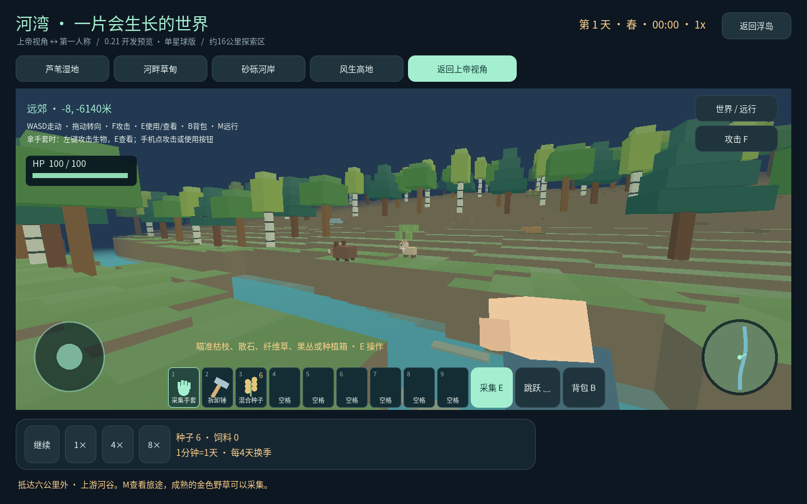
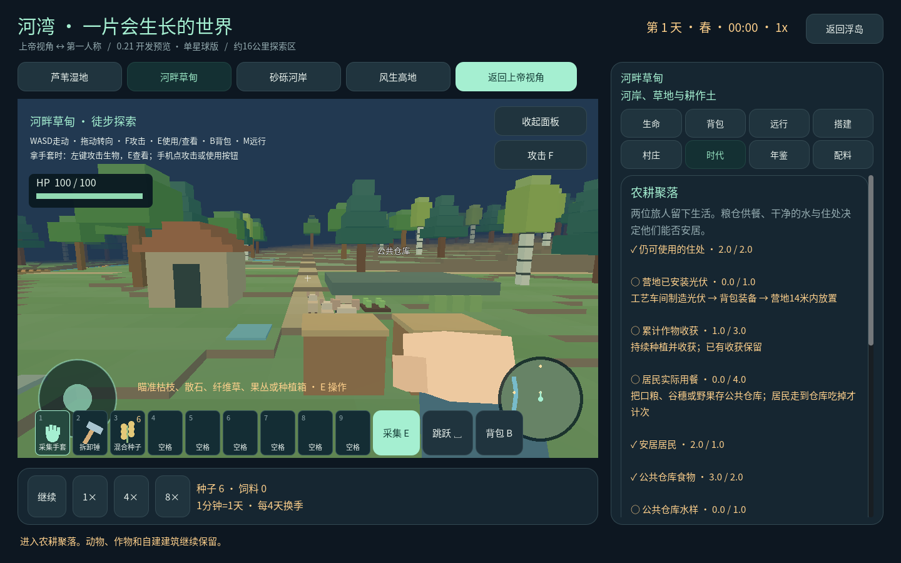

# 更远的原野，更清楚的时代进度

0.21.0-frontier-17 将同一个星球的探索区扩到直径约16.4公里，是此前面积的256倍。旧河湾、已有建筑、作物和材料库存继续保留。

## 往远方走，也能找到回家的路

按 **M / 世界·远行**，新增「千米林海」和「六公里外·上游河谷」两个远征入口。也可以全程步行，沿途继续砍树、种树、挖填、采集、搭建、放种植箱和配料罐。

点击 **记住当前位置**，保存自己的路标。最多24个，随存档保留；从远行页可回到这些位置。移除标记不会删除该地点的建筑。落脚处被后来盖的房子堵住时，会寻找附近空地；找不到时保留当前位置。

地图按玩家位置生成附近地形，渲染缓存仍限制为49个区块，每帧最多生成1个。远处画面卸载后，树桩、地形改造、建筑、野外栖地与动物记忆保留；返回不会重新刷满已采集的植物。地点记录不再卡在原先的300个，生物查找和计时按附近地点进行，不逐帧扫描全部探索历史。远处栖地暂停模拟，起始河湾继续沿用现有模拟规则。

这是**大范围、有边界的世界**，尚未实现数学意义上的无限、磁盘区块分页、地下洞穴或跨无限坐标的原点迁移。已有建造512块、树木/地形改造等数量限制仍保留，避免承诺无限库存与无限建造。若未来扩得更远，还要处理存档分页、持续探索的内存预算和精度问题；[Godot大世界坐标说明](https://docs.godotengine.org/en/stable/tutorials/physics/large_world_coordinates.html)解释了远离原点时单精度坐标的限制。本版远距离截图和跳跃/碰撞检查为桌面验证，手机表现需实测。

## 时代切换现在看同一份条件清单

原先有几个不一致：公共仓库谷穗不计入建村粮食；现代阶段没有重查住处、补给与居民状态；放一个光伏就能过设备条件，未验证实际发电；画面已有的人物也未立刻更新时代外形。

现在「时代」页逐项显示已完成/未完成、当前数量和目标，以及缺少条件的完成方法。按钮和说明使用同一份检查结果；不满足时按钮禁用，满足后自动可用。建造条件只计算草甸营地中心14米内的构件，远方的房屋不会误算成营地住房。

| 进入阶段 | 必须同时满足 |
| --- | --- |
| 农耕聚落 | 6块木构；屋顶正下方2格可站立空间；实际作物收获1次；口粮及公共仓库食物合计3份；草甸水位至少25% |
| 现代生态站 | 仍有2格可住空间；营地安装1件光伏；累计作物收获3次；居民实际用餐4次；至少1位健康≥50%、饥饿≤65%的居民；公共仓库食物2份、水样1份；实际积蓄2点太阳能服务点 |

几条容易混淆的地方：

- **住房**是搭出来的屋顶和净空，不是一个要购买的“可站立屋檐”道具。高处屋顶正下方须有1.75米净空，紧邻屋顶的露天地面不算。
- **收获**来自成熟作物，不由捡野果、购买食物或重复点击增加。种植箱的谷穗存入公共仓库后也可用于建村。
- **供餐**是居民真正走到公共仓库吃掉食物；只有背包里有食物不算已供应。仓库中的口粮、谷穗、野果都能供餐。
- **水**分用途：草甸区域补水改变区域水位；种植箱浇水只作用于箱子；村庄页存入反应釜水样才是仓库补给。
- **发电**需要安装车间制造的光伏并经过白天。暂停、夜间或还在背包里的器件不提供发电进度。太阳能服务点是游戏数值。

时代切换保留动物、作物和建筑，现代居民的外形立即更新。已经进入现代阶段的旧存档保留阶段，不因新增条件自动倒退。

如果居民全部失去，可以在时代页修复住房，用公共仓库2份食物、1份水样作为安家补给，邀请一位新旅人填补空缺。新居民独立记录身份，最多保留两个岗位；补给不足不会消耗资源或生成居民。

目前三个可玩阶段仍是 **原野营地 → 农耕聚落 → 现代生态站**。史前生物、古代城镇、完整工业社会、未来科技尚未实装，页面明确显示没有下一阶段。光伏目前沿用合作方标准组件加车间组装路线，不能当作玩家任意新材料自动具备真实光伏效率；把自研材料进一步接入器件配方仍是后续内容。
