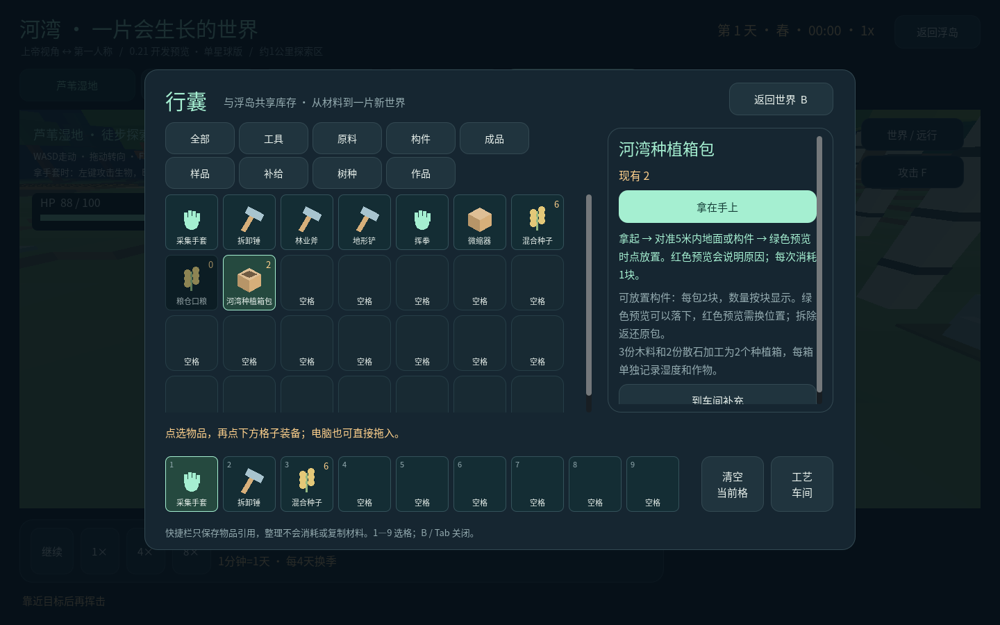
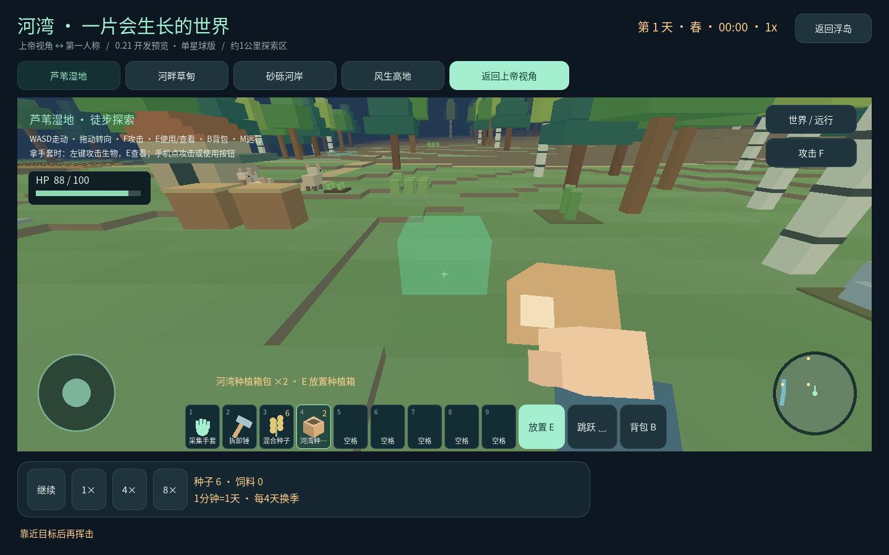

# 河湾的攻击与放置

0.21.0-ranch-13.2 开发预览修复。

## 怎样攻击和查看

进入河湾第一人称，对准动物或人物，走到3.2米以内：

- **F / 右上角“攻击”按钮**：直接挥拳，不用先在背包里寻找工具，也不改变手中物品。
- **拿着采集手套时**：鼠标左键攻击生物；E或“查看”按钮打开资料。点树木和原料仍使用当前工具。
- **拿着挥拳工具时**：E、左键或F都能攻击。其余物品的E/左键保留原用途，例如喂食、浇水和放置。

命中会显示准星反馈、血量和怒气；小鹿逃跑，野猪与人类会反击。两拳之间收拳0.45秒，隔墙、隔树或超出范围都不能命中。生态暂停时可进行手动操作、收拳仍计时；恢复生态后才会继续追击。

## 怎样放置

1. 按 **B** 或点“背包”，选择“构件”。
2. 选中已拥有的物品，点右侧 **拿在手上**。这一步只装备，不消耗库存。
3. 对准5米内的地面或自己的构件。**绿色预览可以放下；红色预览会说明阻碍。**
4. 按 **E**、点“放置”或轻点画面。成功落下才扣除一块；搭高时必须连接已有建筑。

| 背包物品 | 怎样使用 |
| --- | --- |
| 木料、散石、纤维 | 先在浮岛工艺车间加工成墙、屋顶、围栏或种植箱等构件 |
| 构件、太阳能方块、水槽、饲草架 | 拿在手上，瞄准地面或已有构件放置 |
| 橡树、白桦、松树树种 | 瞄准近处空地种植，随后生长 |
| 混合种子 | 对准空种植箱播种 |
| 水样、标准水箱 | 对准树苗、种植箱或饮水槽使用；消耗实际库存 |
| 土方 | 对准地面填高；地形铲可挖回 |
| 微缩作品 | 在河湾空地展开；已放在浮岛展台的作品要先收回 |
| 其他分子样品 | 详情中有已开放用途的才能使用，其余仍可用于浮岛研究和订单 |

“投放当前区域”是背包详情中的独立操作；默认的“拿在手上”不会把水或种子直接消耗在身后的区域。拆卸锤收回自己的构件，原材料回到原包。

## 本次修复

- 攻击增加直接入口，提示跟随手中物品，区分攻击与查看。
- 命中范围对齐画面中正在移动、转身或缩放的生物身体；伤害仍由原生物记录结算。
- 生态暂停后攻击冷却不再永久卡住，持续点按仍受冷却限制。
- 背包“拿在手上”按钮放在详情前部，分类第二行与物品格不再重叠。
- 放置预览显示物品名称和剩余数量；失败不扣材料。右侧世界面板展开时操作条仍在场景范围内。

Android真机尚未验收；实际APK解包后225项桌面模型与交互检查通过。未新增正式功能版本次数，保留此前安装包与存档。
