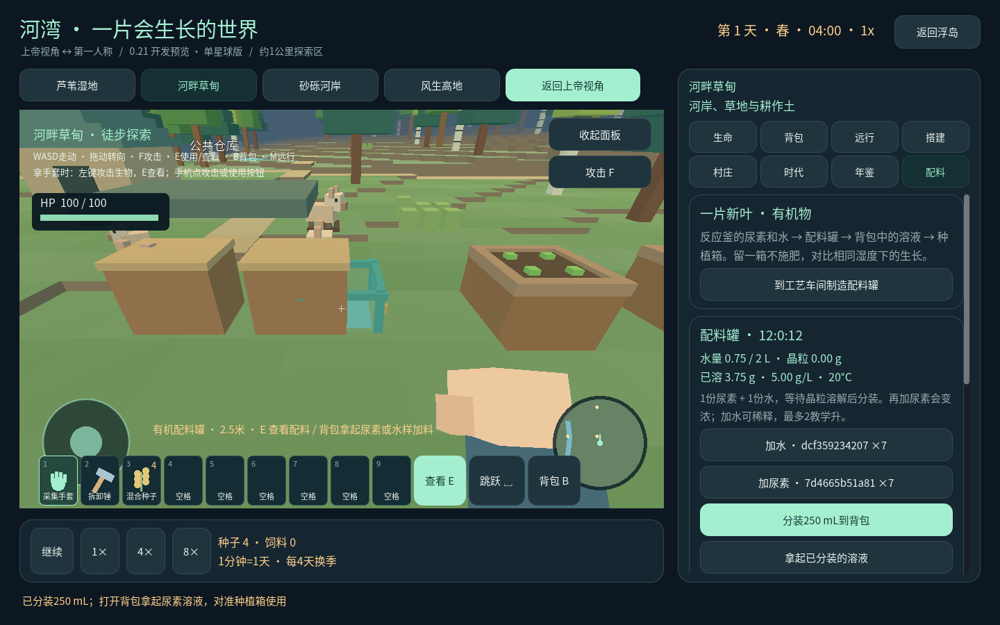
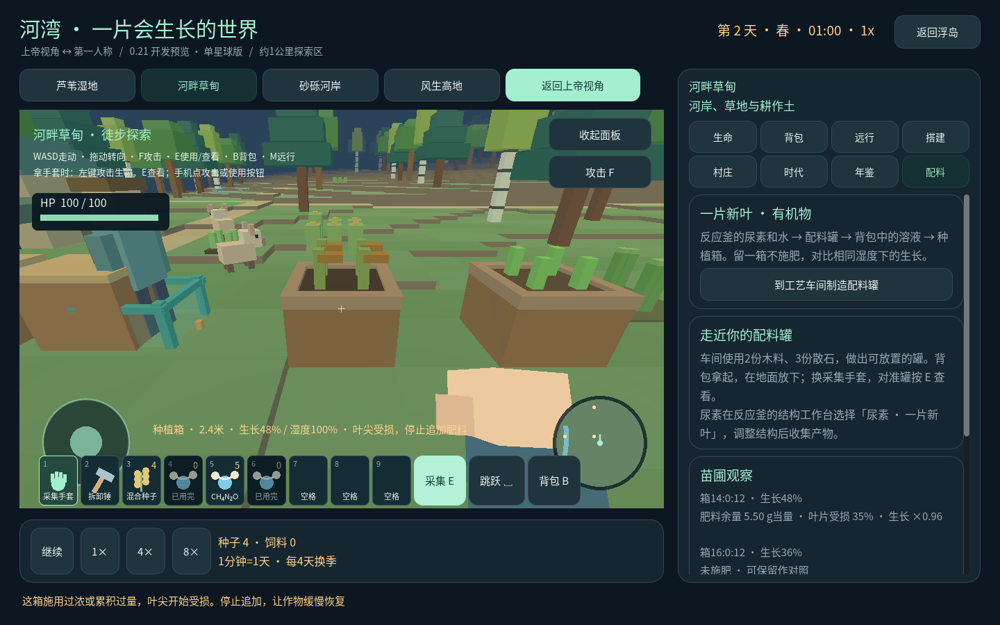

# 一片新叶 · 有机物入门

0.21.0-organic-14.1 开发预览，把反应釜的样品带进河湾苗圃。

## 开始自己的对照种植

1. 选中浮岛反应釜，点 **有机物 · 反应釜合成**。按页面准备元素、提交博士装炉、等待合成，再收获尿素到背包。水样同样由水分子反应釜生产。初始坐标仍需自己调节。[完整合成路线](ORGANIC-15.md)
2. 在工艺车间，用 **2份木料、3份散石** 制作有机配料罐。车间需要连通小路，并有工程师承担生产岗位。
3. 到河湾，背包选“构件”，拿起配料罐，对准地面放下。旁边放两个种植箱，播种并浇水。
4. 换采集手套，瞄准配料罐按 **E / 查看**。加入一份尿素、一份水。恢复星球时间，观察罐底白色晶粒逐渐消失。
5. 点 **分装250 mL到背包 → 拿起已分装的溶液**，对准其中一个种植箱按 **E / 施肥**。另一箱留作对照，保持湿度相近。

温和补肥会加快湿润作物生长；浓液或反复施用会让叶尖变成黄褐色并减慢生长。停止追加后逐步恢复。配料页的“苗圃观察”显示附近各箱的生长、余肥和受损状态。肥料会留在这一箱土壤中，收获不清除余肥。

## 每份材料都有去向

浮岛与河湾共用背包，不用金币另买星球专用尿素。配料只扣所选批次；每瓶有独立编号与实际浓度。分装同时减少罐内水量和已溶解质量。满罐、错误目标、已经用完的瓶子都会拒绝操作，不额外扣料。

罐中有余料时不能拆回或微缩。需要搬迁可先分装用完，或点“封存余料”腾空罐；封存不会退回样品，也不会把废液倒进河里。土壤还有余肥或受损状态时也不能通过拆箱重置。旧存档首次打开此版时获得空的有机物记录，原有库存保留。

## 科学依据与游戏简化

尿素 CH₄N₂O 是这次新增的有机参考物质。身份按元素与连接图识别，不能只凭相同分子式冒用物性。工作台几何为明确标注的教学构造，初始位置扰动；不宣称实验最低能结构。甲烷等既有物质不会自动继承尿素用途。

尿素易溶于水，环境中的转化取决于条件；本次没有实现完整的微生物转化链。[OECD 尿素评估](https://hpvchemicals.oecd.org/UI/handler.axd?id=89564308-0887-4614-8a20-e542ce76221a)

尿素可作氮肥，但局部水解产生的氨和高pH条件可能伤害幼苗。游戏据此设计“温和补肥—过量伤苗”，具体加速倍率、剂量阈值和恢复速度均是玩法参数，不是农业施肥建议。[明尼苏达大学：Fertilizer urea](https://extension.umn.edu/agriculture/crop-production/nutrient-management-for-minnesota-crops/fertilizer-urea)

- 每份尿素映射为 **5教学克**，每份水样为 **1教学升**，仅用于比较。不是反应釜真实产率，溶液体积忽略混合体积变化。
- 配料罐固定20°C；最多2教学升水、40教学克尿素。此上限是设备/玩法容量，**不是饱和溶解度**。公开资料的1080 g/L与624 g/L体积口径待核查，因此运行时定量溶解度保持空值，不外推浓溶液。
- 溶解速度单独设定，每个星球秒0.5教学克。暂停停止溶解，加速随世界时间推进；与渲染帧率无关。
- 苗圃中的剩余量按肥料当量记账，并记录被作物利用的当量；未建模的水解产物不能声称仍是原尿素分子。
- 动物毒理终点保持未知，不提供“毒性80”之类通用分数。当前溶液只用于已播种的种植箱，不能作为饮水或饲料。

数值与证据在 `data/organic_materials.json` 分开存放。配料账本、交互、面板、3D显示各有独立模块。首版未包含乙醇/糖的生产链、发酵、河道污染扩散或动物中毒仿真；它们后续分别按用途与证据扩展。
