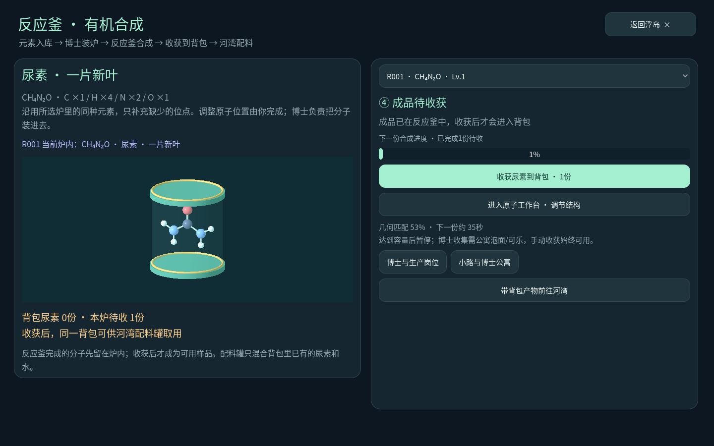

# 有机物从反应釜开始

0.21.0-organic-15 补齐尿素的合成入口与实际产物流转。已有炉子、元素、博士、背包和配料罐共用同一套记录。

## 在哪里开始

- 浮岛选中反应釜，点 **有机物 · 反应釜合成**。
- 第一人称打开炉子的工作台，点 **有机物合成路线 / 反应釜合成**。
- 河湾“配料”页点 **回浮岛反应釜 · 合成尿素**。
- 工艺车间选择配料罐后，也有前往反应釜的入口。

## 从元素变成背包中的一份尿素

1. **选一台自己的反应釜。** 页面显示炉内当前分子；装炉完成前，原来的分子仍在生产。
2. **准备元素。** 尿素结构包含C×1、H×4、N×2、O×1。复用所选炉已有的同种元素，只补缺少的位点；“购齐缺少元素”仅购买元素入库，不产生分子。
3. **提交博士装炉。** 预留元素与该炉等级对应的固定编辑费。需要博士、小路与连通的反应釜；缺人、岗位不对或断路会显示具体原因。重复提交不重复收费，取消原数退回。
4. **等待反应釜合成。** 博士真正走到炉旁并完成安装后，炉内换成尿素。初始坐标未调优，可以进入原子工作台调整。合成速度沿用原有几何匹配与炉等级规则。
5. **收获到背包。** 完成的产物先停留在反应釜缓冲区；点收获，或让有补给的博士收集后，才进入共享背包。满炉暂停，重复收获不会增加库存。
6. **带同一批样品去河湾。** 配料罐消耗刚刚收获的尿素批次，与水配成溶液。[配水、分装与种植箱对照流程](ORGANIC-14.md)保持不变。

页面里的3D分子来自所选反应釜的实际结构。这里不直接发放尿素，也没有另一套星球专用库存；工艺车间制造配料罐等设备。现有放置经营的产能仍是游戏抽象，未新增真实工业化学反应、温压条件或逐份反应物消耗模型。

第一人称中在工作台与合成路线之间切换，会保留原位置和朝向；有未保存草稿时先提示。新流程沿用旧装炉、生产与存档结构，保留历史产物批次。
