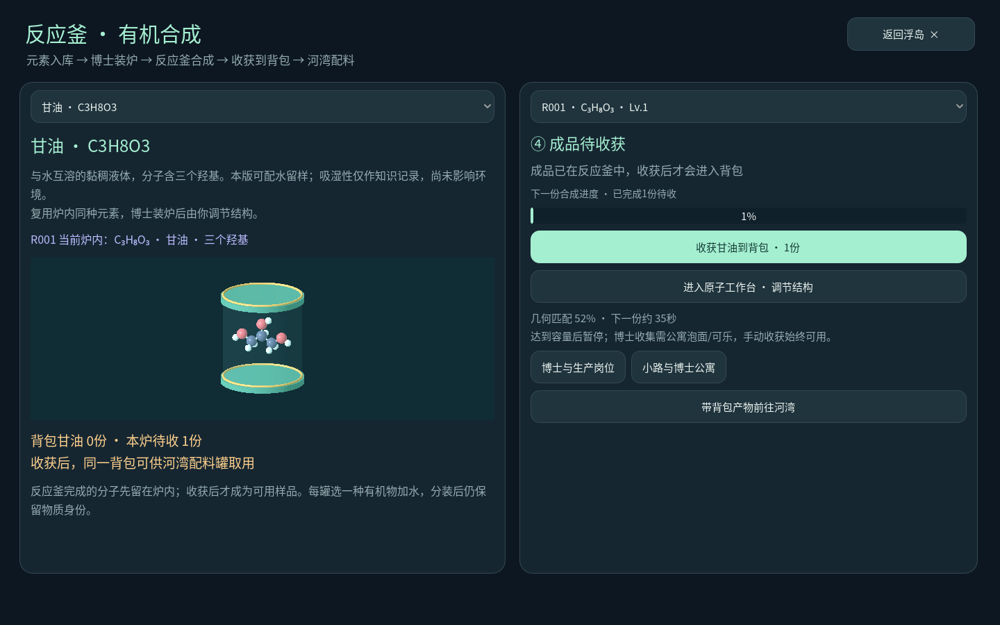

# 三种有机物，三只配料罐

0.21.0-organic-16 新增乙醇和甘油。它们和尿素一样，从自己的反应釜开始：备齐元素、让博士装炉、调节结构、等待生产，再收获到同一个背包。

## 先选一种分子

浮岛选中反应釜，点 **有机物 · 反应釜合成**。左上角可以切换尿素、乙醇、甘油；右边仍然是你选中的那台炉子。切换目录只是查看需求，点击提交才会预留元素与装炉费用。

| 分子 | 组成 | 这一版怎么玩 |
| --- | --- | --- |
| 尿素 | CH₄N₂O | 晶粒加水溶解，分装后给种植箱补肥，留一箱作对照 |
| 乙醇 | C₂H₆O | 液体配水、混合、分装，比较加水前后的浓度 |
| 甘油 | C₃H₈O₃ | 观察三个羟基的分子，配水留样，与乙醇的结构作比较 |

## 把产物带到河湾

工艺车间制造配料罐，背包拿起后放到地面。每只罐只做一种有机物的加水实验；可以并排摆三只，分别装不同样品。

1. 收获反应釜产物，在背包里拿起，瞄准配料罐按 **E / 加料**。也可以拿采集手套查看罐子，在配料页选择实际库存中的批次。
2. 加一份水样。尿素会显示逐渐减少的晶粒，乙醇、甘油显示液体待混料；等待混合后查看浓度。
3. 分装一瓶。瓶子的名称、物质身份和浓度保留在背包里。
4. 想继续比较浓度：拿起瓶子，瞄准空罐或同种罐按 **E / 倒回**，再补一份水。倒回会用掉原瓶，余量不会重复增加。

每份有机物为5教学克，水样为1教学升，分装为250教学毫升；一份有机物配一份水是5教学g/L，再加一份水变成2.5教学g/L。每罐最多2教学升水、40教学克有机物，满罐拒绝加料并保留背包物品。

这些单位用于比较配料，按载水量计算浓度；未模拟真实混合体积与体积收缩。混合速度同为每秒0.5教学克，这是便于观察的游戏设定，不是实测溶解动力学或黏度。乙醇、甘油本版用于配水实验与留样，暂未开放燃料、保湿、生物投放等用途。尿素溶液仍可施肥，不能把其他有机物替代成尿素。

## 物性说明的依据

- 乙醇的身份、分子式、液态和与水互溶记录来自 [CDC NIOSH：Ethyl alcohol](https://www.cdc.gov/niosh/npg/npgd0262.html)。
- 甘油的身份、分子式、黏稠外观、与水互溶和吸湿性记录来自 [CDC NIOSH：Glycerin](https://www.cdc.gov/niosh/npg/npgd0302.html)。吸湿性仅作为知识说明，未驱动环境变化。
- 尿素的物性与施肥依据见 [尿素配水与苗圃](ORGANIC-14.md)。

两种互溶液体不填一个虚构的有限饱和溶解度；未核查的毒理终点保留未知。新分子的连接关系用于物质识别，坐标与键长是教学构造，初始位置沿用未调优规则，不宣称是计算得到的低能构象。

旧版尿素配料、溶液和封存余料会自动读取；新版分别核对每种物质的库存、罐中余量、瓶中余量与封存量。
